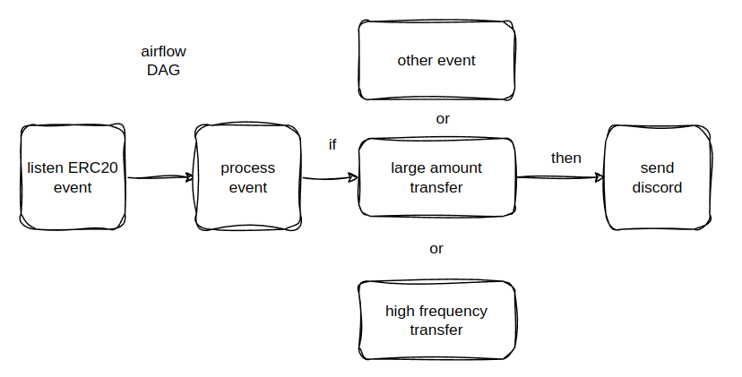

# ERC20 Token Transfer Monitoring with Airflow 🚀📊

   

This repository contains an **ERC20 token transfer monitoring system** built using **Apache Airflow**. The system listens for ERC20 transfer events on a blockchain and identifies abnormal patterns like large transactions or frequent transfers by any account. Detected anomalies are reported via **Discord alerts**. 📡🔍

## Key Features ✨

- **Real-time Monitoring**: Continuously tracks ERC20 token transfers on the blockchain in real-time. 🕒
- **Anomaly Detection**: Detects large transfers and unusual account activity.
- **Discord Alerts**: Sends instant alerts to Discord channels when anomalies are detected. ⚠️
- **Scalable and Modular**: Uses Apache Airflow for efficient task orchestration, making it scalable. 💡
- **Fault Tolerant**: Automatic retries on failure, with robust logging for troubleshooting. 🛠️

## How It Works ⚙️

The monitoring system operates through an **Apache Airflow DAG** (Directed Acyclic Graph) that runs periodically, fetching ERC20 token transfers, processing them, and checking for anomalies.

### Main Components 🧩
- **ERC20 Event Listener**: Tracks ERC20 token transfer events from the blockchain.
- **Anomaly Detection**:
  - **Large Transfers**: Detects transfers exceeding a certain threshold. 💸
  - **Frequent Transfers**: Identifies accounts making multiple transfers in a short time. 🕹️
- **Discord Notifications**: Sends alerts to a Discord channel when anomalies are detected. 📩



## Installation and Setup 🔧

### Prerequisites ✅

- **Python 3.7+** 🐍
- **Apache Airflow** (2.x) 🌬️
- **Web3.py**: For blockchain interaction. ⛓️
- **Discord.py**: For sending Discord notifications. 💬
- **Infura/Alchemy API**: Blockchain access service for Ethereum.

### Install Dependencies

Install the required Python packages using `pip`:

```bash
pip install -r requirements.txt
```

### Configuration 🛠️

1. Set up your blockchain access and Discord credentials in the `config.py` file. You can use the provided template `config.py.example`:

```python
INFURA_URL = 'https://mainnet.infura.io/v3/YOUR_INFURA_PROJECT_ID'
ERC20_CONTRACT_ADDRESS = '0xYourContractAddress'
DISCORD_TOKEN = 'your_discord_token'
CHANNEL_ID = your_discord_channel_id
```

2. Update the **transfer thresholds** and **block window** for anomaly detection in the DAG file if needed.

### Running Airflow 🚀

Once Airflow is installed, start the **scheduler** and **web server**:

```bash
airflow scheduler
airflow webserver
```

Deploy the DAG by placing the DAG file (`erc20_monitor.py`) into your Airflow `dags/` directory.

### Alerts 💬

The system will automatically send alerts to your configured Discord channel if any anomalies are detected, such as:

- **Large Transfers**: When the token transfer exceeds the configured threshold.
- **Frequent Transfers**: If an account makes multiple transfers within a defined block window.

## Example Workflow 📝

```python
t1 >> t2 >> t3
t1 >> t4 >> t3
```

Where:
- `t1`: Listens for ERC20 events. 👂
- `t2`: Detects large transfers. 💵
- `t4`: Monitors frequent transactions. 🔄
- `t3`: Sends Discord alerts. 📣

## Testing 🧪

Make sure to run the included test suite to ensure everything works properly. The tests cover core functionality like transfer detection and alerting.

To run tests:
```bash
pytest
```

## Contributing 🤝

We welcome contributions! Check out the [CONTRIBUTING.md](CONTRIBUTING.md) file for details on how to get involved.

1. Fork the repository. 🍴
2. Create a new branch (`git checkout -b feature/new-feature`). 🌿
3. Make your changes and commit them (`git commit -am 'Add new feature'`). 📦
4. Push the branch (`git push origin feature/new-feature`). 📤
5. Create a Pull Request. 🛠️

## License 📜

This project is licensed under the **MIT License**. See the [LICENSE](LICENSE) file for details.

---

**Happy Monitoring!** 🕵️‍♂️✨

---
